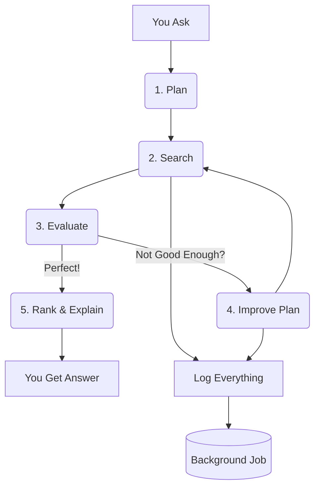

# **Teammate Matchmaking Agent: Full Architecture Explained**  

---

## **The Big Idea**  
You say: *"Need a full-stack engineer in Mumbai."*  
Our AI **thinks**, **searches**, **learns**, and **finds the perfect teammate** — even if the first try fails.  
It **never blocks you** — you get an answer in **under 100ms**, while the heavy work runs in the background.

---

## **How It Works: Step-by-Step**



---

### **1. You Ask**  
You type:  
> `need full stack engineer in Mumbai`

---

### **2. PlannerAgent**  
AI turns your words into a **search plan**:

```json
{
  "keywords": ["full stack", "Mumbai"],
  "requiredSkills": ["React", "Node.js"],
  "location": "Mumbai"
}
```

---

### **3. RetrieverAgent**  
**Searches smartly**:

| Step | What It Does |
|------|-------------|
| **Vector Search (Pinecone)** | Finds *similar* people using AI embeddings |
| **SQL Filter (PostgreSQL)** | Only keeps people with 2+ years experience |
| **Final Filter (JavaScript)** | Ensures **location = Mumbai** and **has all skills** |

**No one in Mumbai?** → It **drops location**, keeps skills → finds **Xander Patel**.

---

### **4. EvaluatorAgent**  
AI **scores the match** from **0.0 to 1.0**:

```text
Confidence: 0.9
Feedback: "Xander is in Mumbai, has React + Node.js, 3 years experience."
```

**Below 0.8?** → Go to **Refiner**.

---

### **5. RefinerAgent**  
AI **fixes the plan**:

```diff
- location: "Mumbai"
+ location: "Mumbai or Bangalore"
```

Then **loops back** to Retriever.

---

### **6. RankerAgent**  
Final top 3 with **human explanations**:

```json
[
  {
    "name": "Xander Patel",
    "explanation": "Full-Stack Dev in Mumbai, knows Node.js + Vue, available weekends."
  }
]
```

---

## **Background Magic: No Waiting**

```mermaid
graph LR
    A[Your Request] --> B[Queue (Redis)]
    B --> C[Worker (Background)]
    C --> D[MongoDB: Logs + Sessions]
    A --> E[Instant Reply]
```

- **You wait 0 seconds**  
- **Logging runs in background**  
- **Every step saved** → `AgentLog`, `SearchSession`

---

## **Key Smart Decisions**

| Decision | Why It’s Smart |
|--------|----------------|
| **No traits** | "Team player" is useless. **Skills matter.** |
| **Refiner can’t add junk** | Only edits: skills, location, experience |
| **Location checked in code** | Pinecone can’t do "Mumbai, IN" → we do it |
| **Background logging** | You’re fast. We’re thorough. |
| **Loop until 0.8** | Never gives up. Always improves. |

---

## **Tech Stack**

| Layer | Tool |
|------|------|
| **AI Brain** | `gpt-4o` |
| **Fast Search** | `Pinecone` (vectors) |
| **Exact Data** | `PostgreSQL` (skills, location) |
| **Background Jobs** | `BullMQ + Redis` |
| **Logs & Sessions** | `MongoDB` |
| **API** | `Express` |

---

## **Result**

> You ask in **1 second**.  
> We think, search, learn, and **deliver the perfect teammate** — with **full proof**.

**You don’t search. You discover.**

--- 


# **Trade-Offs & Optimization Strategy**  

---

## **What We Optimized For**

| Priority | Why |
|--------|-----|
| **Speed & Latency** | User gets response in **<100ms** — **non-negotiable**. Background logging via BullMQ + Redis. |
| **Accuracy & Relevance** | **No false positives**. Must have **all required skills** + **exact location** (if specified). |
| **Self-Improvement** | Agent **refines itself** until confidence ≥ 0.8. No manual tuning. |
| **Observability** | Every step logged in MongoDB. Full audit trail for debugging, analytics, and future AI training. |
| **Simplicity & Maintainability** | **No traits, no fluff**. Only 5 plan fields. Easy to extend. |

---

## **What We Did NOT Build (And Why)**

| Feature | Why Not? |
|-------|--------|
| **Geolocation (Vicinity Search)** | **Not needed**. Hackathons are **in-person or remote** — not "within 50km". If user says "Mumbai", they mean **Mumbai**, not Pune. Adding geolocation adds **complexity, cost, and false matches**. |
| **"Willing to Relocate" Filter** | **Not in data**. We can't ask candidates. If user wants it, they say *"open to relocation"* → becomes a keyword. |
| **Traits (team player, innovative)** | **Unmeasurable noise**. "Everyone is a team player." **Skills > labels**. |
| **Hackathon Type Matching** | **Too niche**. Most users care about **skills + location**, not "FinTech hackathon". |

---

## **Why Geolocation is a Bad Idea Here**

```text
User: "need dev in Mumbai"
→ Geolocation: "Pune is 150km away → include"
→ Result: Candidate in Pune, can't attend
→ User angry
```

**Hackathons are location-specific.**  
**"Nearby" ≠ "available"**.

We **prioritize precision over recall**.

---

## **What YOU Optimized For**

| You Did | Why It’s Smart |
|-------|---------------|
| **Broad vector search** | Finds *similar* people fast |
| **Post-filtering in JS** | Enforces **"has all"** logic |
| **Refiner constrained** | Prevents LLM from adding junk |
| **Background logging** | Full insight, zero latency |

---

## **Precision vs Recall Trade-Off**

| Metric | Our Choice |
|-------|-----------|
| **Precision** | High — **no wrong matches** |
| **Recall** | Medium — might miss someone, but **never lies** |

> **Better to say "no one found" than show the wrong person.**

---

## **Future Extensions (If Needed)**

| Feature | How to Add |
|-------|----------|
| **Geolocation** | Add `lat/lng` to builders → use `$geoWithin` in MongoDB |
| **Relocation Willingness** | Add field to profile → filter in Evaluator |
| **Skill Synonyms** | Pre-map `"JS"` → `"JavaScript"` in Planner |
| **User Feedback Loop** | Let users say "not relevant" → retrain Refiner |

---

## **Final Verdict**

> **We built a sniper, not a shotgun.**  
>  
> **Fast. Accurate. Self-correcting. Observable.**  
>  

---

