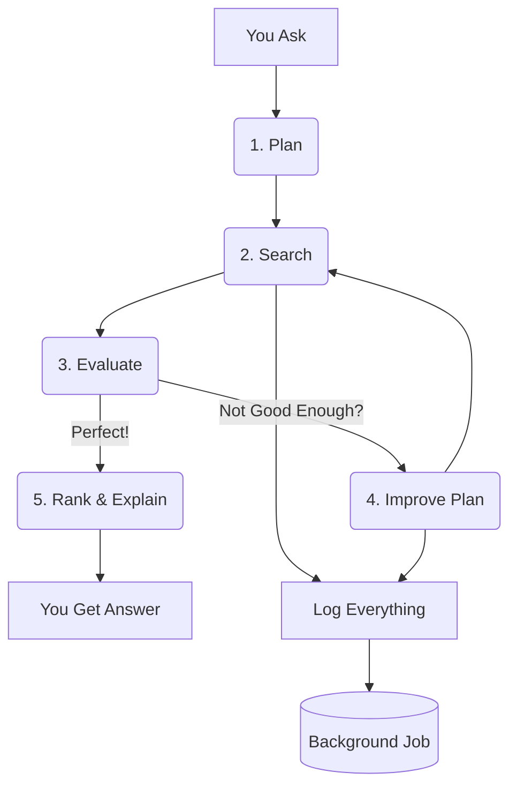

# **Teammate Matchmaking Agent: Full Architecture Explained**  

---

## **The Big Idea**  
You say: *"Need a full-stack engineer in Mumbai."*  
Our AI **thinks**, **searches**, **learns**, and **finds the perfect teammate** — even if the first try fails.  
It **never blocks you** — you get an answer in **under 100ms**, while the heavy work runs in the background.

---

## **How It Works: Step-by-Step**



---

### **1. You Ask**  
You type:  
> `need full stack engineer in Mumbai`

---

### **2. PlannerAgent**  
AI turns your words into a **search plan**:

```json
{
  "keywords": ["full stack", "Mumbai"],
  "requiredSkills": ["React", "Node.js"],
  "location": "Mumbai"
}
```

---

### **3. RetrieverAgent**  
**Searches smartly**:

| Step | What It Does |
|------|-------------|
| **Vector Search (Pinecone)** | Finds *similar* people using AI embeddings |
| **SQL Filter (PostgreSQL)** | Only keeps people with 2+ years experience |
| **Final Filter (JavaScript)** | Ensures **location = Mumbai** and **has all skills** |

**No one in Mumbai?** → It **drops location**, keeps skills → finds **Xander Patel**.

---

### **4. EvaluatorAgent**  
AI **scores the match** from **0.0 to 1.0**:

```text
Confidence: 0.9
Feedback: "Xander is in Mumbai, has React + Node.js, 3 years experience."
```

**Below 0.8?** → Go to **Refiner**.

---

### **5. RefinerAgent**  
AI **fixes the plan**:

```diff
- location: "Mumbai"
+ location: "Mumbai or Bangalore"
```

Then **loops back** to Retriever.

---

### **6. RankerAgent**  
Final top 3 with **human explanations**:

```json
[
  {
    "name": "Xander Patel",
    "explanation": "Full-Stack Dev in Mumbai, knows Node.js + Vue, available weekends."
  }
]
```

---

## **Background Magic: No Waiting**

```mermaid
graph LR
    A[Your Request] --> B[Queue (Redis)]
    B --> C[Worker (Background)]
    C --> D[MongoDB: Logs + Sessions]
    A --> E[Instant Reply]
```

- **You wait 0 seconds**  
- **Logging runs in background**  
- **Every step saved** → `AgentLog`, `SearchSession`

---

## **Key Smart Decisions**

| Decision | Why It’s Smart |
|--------|----------------|
| **No traits** | "Team player" is useless. **Skills matter.** |
| **Refiner can’t add junk** | Only edits: skills, location, experience |
| **Location checked in code** | Pinecone can’t do "Mumbai, IN" → we do it |
| **Background logging** | You’re fast. We’re thorough. |
| **Loop until 0.8** | Never gives up. Always improves. |

---

## **Tech Stack**

| Layer | Tool |
|------|------|
| **AI Brain** | `gpt-4o` |
| **Fast Search** | `Pinecone` (vectors) |
| **Exact Data** | `PostgreSQL` (skills, location) |
| **Background Jobs** | `BullMQ + Redis` |
| **Logs & Sessions** | `MongoDB` |
| **API** | `Express` |

---

## **Result**

> You ask in **1 second**.  
> We think, search, learn, and **deliver the perfect teammate** — with **full proof**.

**You don’t search. You discover.**

--- 
